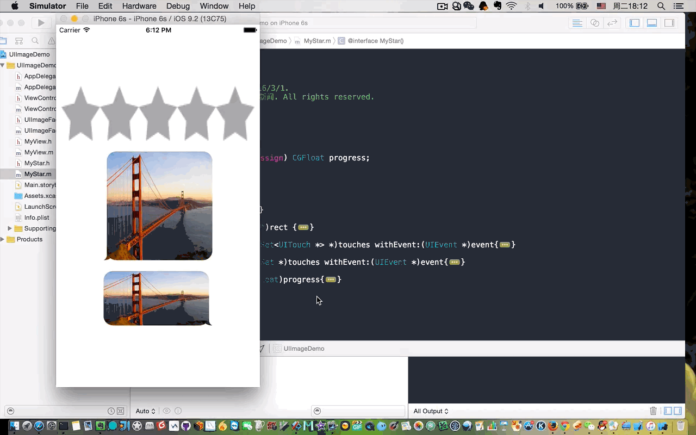

##### UIImage相关操作

最近看了下JSQMessage的源码，一个比较优雅的UI库，代码很赞，只用了少量的图片，牵扯了一些UIImage的相关操作。虽然控件比较基本 ，但是一些用法还是不是很清楚，希望接下来能有时间去整理下其他的基础控件。此次仅为UIImage的一些相关操作。

Github下载地址:https://github.com/ChinaFishNews/UIImageDemo

博客地址:http://chinafish.news/2016/03/01/UIImage的相关操作/

如有任何疑问或问题请联系我:fishnewsdream@gmail.com,欢迎交流，共同提高！


####  通过颜色生成纯色图片
```
+(UIImage *)imageWithColor:(UIColor *)color
                  withSize:(CGSize)size{
    
    CGRect rect = CGRectMake(0, 0, size.width, size.height);
    
    UIGraphicsBeginImageContext(rect.size);
    
    CGContextRef context = UIGraphicsGetCurrentContext();
    
    CGContextSetFillColorWithColor(context, [color CGColor]);
    
    CGContextFillRect(context, rect);
    
    UIImage *image = UIGraphicsGetImageFromCurrentImageContext();
    
    UIGraphicsEndImageContext();
    
    return image;
}
```

#### 通过图片生成圆形图片
 
```
+(UIImage *)circualImage:(UIImage *)image
            withDiameter:(NSUInteger)diameter{
    
    CGRect frame = CGRectMake(0.0f, 0.0f, diameter, diameter);
    UIImage *newImage = nil;
    
    UIGraphicsBeginImageContextWithOptions(frame.size, NO, [UIScreen mainScreen].scale);
    {
        UIBezierPath *imgPath = [UIBezierPath bezierPathWithOvalInRect:frame];
        [imgPath addClip];
        [image drawInRect:frame];
        
        newImage = UIGraphicsGetImageFromCurrentImageContext();
        
    }
    UIGraphicsEndImageContext();
    
    return newImage;
}
```
####  通过图片或颜色生成圆形图片(如传入颜色则通过颜色生成)
```
+(UIImage *)circualarImage:(UIImage *)image
              withDiameter:(NSUInteger)diameter
          highlightedColor:(UIColor *)highlightedColor{
    
    CGRect frame = CGRectMake(0.0f, 0.0f, diameter, diameter);
    UIImage *newImage = nil;
    
    UIGraphicsBeginImageContextWithOptions(frame.size, NO, [UIScreen mainScreen].scale);
    {
        CGContextRef context = UIGraphicsGetCurrentContext();
        
        UIBezierPath *imgPath = [UIBezierPath bezierPathWithOvalInRect:frame];
        [imgPath addClip];
        [image drawInRect:frame];
        
        if (highlightedColor != nil) {
            CGContextSetFillColorWithColor(context, highlightedColor.CGColor);
            CGContextFillEllipseInRect(context, frame);
        }
        newImage = UIGraphicsGetImageFromCurrentImageContext();
        
    }
    UIGraphicsEndImageContext();
    
    return newImage;
}
``` 

####  在已有图片上添加文字
```
+(UIImage *)addTextInImage:(UIImage *)image
                     text:(NSString *)text
                textColor:(UIColor *)textColor
                     font:(UIFont *)font{
    
    CGRect frame = CGRectMake(0.0f, 0.0f, image.size.width, image.size.height);
    
    NSDictionary *attributes = @{ NSFontAttributeName : [UIFont systemFontOfSize:33],
                                  NSForegroundColorAttributeName : textColor };
    
    CGRect textFrame = [text boundingRectWithSize:image.size
                                              options:(NSStringDrawingUsesLineFragmentOrigin | NSStringDrawingUsesFontLeading)
                                           attributes:attributes
                                              context:nil];
    
    CGPoint frameMidPoint = CGPointMake(CGRectGetMidX(frame), CGRectGetMidY(frame));
    CGPoint textFrameMidPoint = CGPointMake(CGRectGetMidX(textFrame), CGRectGetMidY(textFrame));
    
    CGFloat dx = frameMidPoint.x - textFrameMidPoint.x;
//    CGFloat dy = frameMidPoint.y - textFrameMidPoint.y;
    CGFloat dy = frame.size.height - textFrameMidPoint.y*2;;
    CGPoint drawPoint = CGPointMake(dx, dy);
    
    UIImage *newImage = nil;
    UIGraphicsBeginImageContext(frame.size);
    {
        [image drawInRect:CGRectMake(0, 0, frame.size.width, frame.size.height)];
        
        [text drawAtPoint:drawPoint withAttributes:attributes];
        
        newImage = UIGraphicsGetImageFromCurrentImageContext();
    }
    UIGraphicsEndImageContext();
    
    return newImage;
}
```

#### 通过颜色生成图片并添加文字
```
+(UIImage *)imageWithText:(NSString *)text
          backgroundColor:(UIColor *)backgroundColor
                textColor:(UIColor *)textColor
                     font:(UIFont *)font
                     size:(CGSize )size{
    
    CGRect frame = CGRectMake(0.0f, 0.0f, size.width, size.height);
    
    NSDictionary *attributes = @{ NSFontAttributeName : font,
                                  NSForegroundColorAttributeName : textColor };
    
    CGRect textFrame = [text boundingRectWithSize:frame.size
                                              options:(NSStringDrawingUsesLineFragmentOrigin | NSStringDrawingUsesFontLeading)
                                           attributes:attributes
                                              context:nil];
    
    CGPoint frameMidPoint = CGPointMake(CGRectGetMidX(frame), CGRectGetMidY(frame));
    CGPoint textFrameMidPoint = CGPointMake(CGRectGetMidX(textFrame), CGRectGetMidY(textFrame));
    
    CGFloat dx = frameMidPoint.x - textFrameMidPoint.x;
    CGFloat dy = frameMidPoint.y - textFrameMidPoint.y;
    CGPoint drawPoint = CGPointMake(dx, dy);
    UIImage *newimage = nil;
    
    UIGraphicsBeginImageContextWithOptions(frame.size, NO, [UIScreen mainScreen].scale);
    {
        CGContextRef context = UIGraphicsGetCurrentContext();
        
        CGContextSetFillColorWithColor(context, backgroundColor.CGColor);
        CGContextFillRect(context, frame);
        [text drawAtPoint:drawPoint withAttributes:attributes];
        
        newimage = UIGraphicsGetImageFromCurrentImageContext();
        
    }
    UIGraphicsEndImageContext();
    
    return newimage;

}

```

#### 图片叠加
```
+(void)maskView:(UIImageView *)imageView withImage:(UIImage *)image{
    
    UIImageView *imageViewMask = [[UIImageView alloc] initWithImage:image];
    imageViewMask.frame = CGRectMake(0, 0, imageView.frame.size.width, imageView.frame.size.height);

    imageView.layer.mask = imageViewMask.layer;
}
```
或者使用另外一种方法
```
- (void)drawRect:(CGRect)rect {

    UIImage *imageOne = [UIImage imageNamed:@"bubble_min"];
    UIImage *imageTwo = [UIImage imageNamed:@"goldengate"];
    
    [imageOne drawInRect:rect];
    [imageTwo drawInRect:CGRectInset(rect, 0.0f, 0.0f) blendMode:kCGBlendModeSourceIn alpha:1];
}
```

#### 水平旋转图片
```
+(UIImage *)horizontallyFlippedImageFromImage:(UIImage *)image{
    
    return [UIImage imageWithCGImage:image.CGImage
                               scale:image.scale
                         orientation:UIImageOrientationUpMirrored];
}
```

#### 修改图片颜色
   <b> //kCGBlendModeOverlay能保留灰度信息，kCGBlendModeDestinationIn能保留透明度信息<b>
```
+ (UIImage *)imageColorChanged:(UIImage *)image
                     tintColor:(UIColor *)tintColor
                     blendMode:(CGBlendMode)blendMode{
    
    UIGraphicsBeginImageContextWithOptions(image.size, NO, 0.0f);
    [tintColor setFill];
    CGRect bounds = CGRectMake(0, 0, image.size.width, image.size.height);
    UIRectFill(bounds);
    
    [image drawInRect:bounds blendMode:blendMode alpha:1.0f];
    
    if (blendMode != kCGBlendModeDestinationIn) {
        [image drawInRect:bounds blendMode:kCGBlendModeDestinationIn alpha:1.0f];
    }
    UIImage *tintedImage = UIGraphicsGetImageFromCurrentImageContext();
    UIGraphicsEndImageContext();
    
    return tintedImage;
}
```

方法使用:




